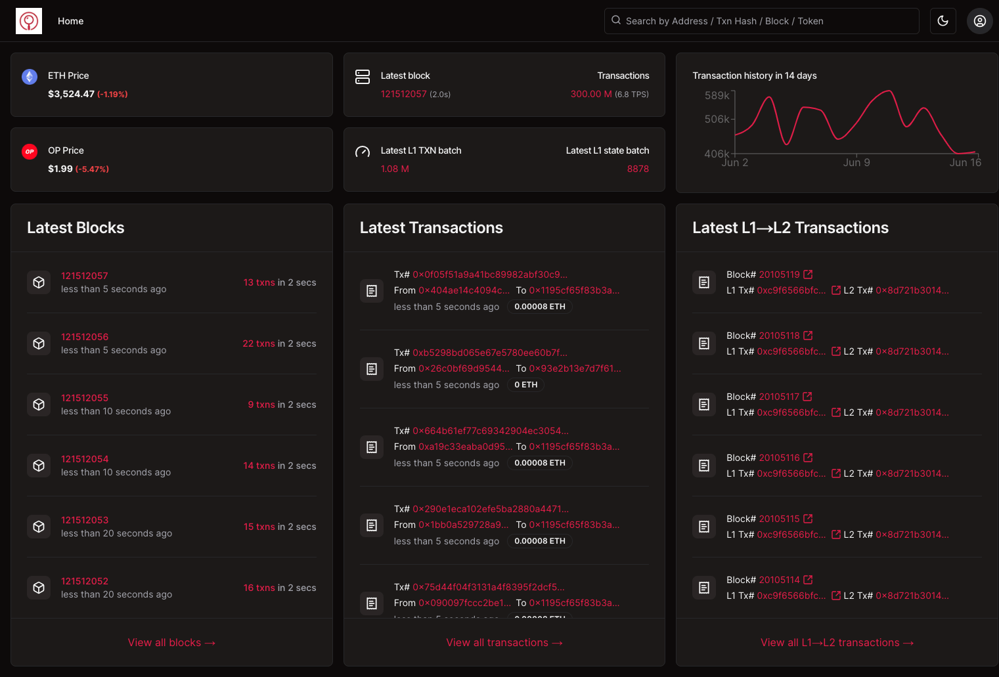

# 🔎 OP Scan

OP Scan is a transaction explorer tailored specifically for the [OP Stack](https://docs.optimism.io/stack/getting-started) and the [Superchain vision](https://docs.optimism.io/superchain/superchain-explainer). It's focused on being lightweight so that anyone can run it locally next to an OP Stack devnet or any other compatible OP Stack based rollup.



# 🦄 How OP Scan Differs from Other Explorers

1. **Lightweight**: The code and dependencies are designed to be minimalistic. This ensures minimal resource consumption, allowing anyone to run it locally alongside an OP Stack node when working on a rollup.
2. **OP Stack Native**: This explorer is purpose-built for the OP Stack. It ensures 100% compatibility with rollups in Optimism’s Superchain.
3. **Scalable**: Despite its lightweight design, the explorer is built to handle any scale.
4. **Open Source**: All code is open source from day one. This alignment with the community allows anyone to contribute or fork the repository to meet their specific needs.

# 🙋‍♀️ Share Feedback by Submitting an Issue

OP Scan is built for rollups built on the [OP Stack](https://docs.optimism.io/stack/getting-started). If you are interested in it, have feedback or feature request, submit an issue [here](https://github.com/walnuthq/op-scan/issues).

# ⚙️ Installation

### Getting Started Video

[Here's a video walkthrough](https://www.loom.com/share/3b79f0b25e44443eb16d296aba021764) on how to launch the explorer locally configured for OP Sepolia testnet.

### Required Dependencies

The app requires the following dependencies:

```
Node.js >= 22
pnpm >= 9
```

### Explorer Configuration

Clone this repository:

```sh
git clone https://github.com/walnuthq/op-scan.git
```

Install the dependencies:

```sh
pnpm install
```

Copy `.env.local.example` into `.env.local` at the root of your repository and populate it with your own values.
In particular, configure both L1 and L2 chains:

```
NEXT_PUBLIC_L1_CHAIN_ID="11155111"
NEXT_PUBLIC_L1_NAME="Sepolia"
NEXT_PUBLIC_L1_RPC_URL="https://ethereum-sepolia-rpc.publicnode.com"
L1_RPC_WS="wss://ethereum-sepolia-rpc.publicnode.com"
NEXT_PUBLIC_L2_CHAIN_ID="11155420"
NEXT_PUBLIC_L2_NAME="OP Sepolia"
NEXT_PUBLIC_L2_RPC_URL="https://optimism-sepolia-rpc.publicnode.com"
L2_RPC_WS="wss://optimism-sepolia-rpc.publicnode.com"
```

You can get free node rpcs url by signing up to services such as [Alchemy](https://www.alchemy.com/), [Infura](https://www.infura.io/) or [QuickNode](https://www.quicknode.com/).

For devnet usage, follow [this tutorial](https://docs.optimism.io/stack/dev-node) to run a local development environment that will spawn both L1 and L2 chains.
Once your OP Stack devnet is ready, copy your L1 (`el-1-geth-lighthouse`) and L2 (`op-el-1-op-geth-op-node-rollup-1`) RPC urls and get the corresponding chain ids using [Foundry's cast](https://book.getfoundry.sh/reference/cast/):

```
cast chain-id --rpc-url http://127.0.0.1:32771
cast chain-id --rpc-url http://127.0.0.1:32780
```

This will give you the following local chain config:

```
NEXT_PUBLIC_L1_CHAIN_ID="3151908"
NEXT_PUBLIC_L1_NAME="Goerli"
NEXT_PUBLIC_L1_RPC_URL="http://127.0.0.1:32771"
L1_RPC_WS="ws://127.0.0.1:32772"
NEXT_PUBLIC_L2_CHAIN_ID="12345"
NEXT_PUBLIC_L2_NAME="rollup-1"
NEXT_PUBLIC_L2_RPC_URL="http://127.0.0.1:32780"
L2_RPC_WS="ws://127.0.0.1:32781"
```

Next you will need to find the L1 contract addresses for both the Optimism Portal and the Cross Domain Messenger.
You will find the L1CrossDomainMessenger address in your local devnet logs:

```
- L1CrossDomainMessengerProxy: 0x170d06930Ce8c7487EF12Be36d20C400Eb0fA8B2
```

Then fetch the Portal address from the Cross Domain Messenger using `cast call`:

```
cast call 0x170d06930Ce8c7487EF12Be36d20C400Eb0fA8B2 "PORTAL()" --rpc-url http://127.0.0.1:32771
```

The result being an address, only take the first 20 bytes from the returned value:

```
0x000000000000000000000000e373471c58424978b4652db046817c209f09e645 -> 0xe373471c58424978b4652db046817c209f09e645
```

Copy these addresses to your local chain config:

```
NEXT_PUBLIC_L1_CROSS_DOMAIN_MESSENGER_ADDRESS="0x170d06930Ce8c7487EF12Be36d20C400Eb0fA8B2"
NEXT_PUBLIC_OPTIMISM_PORTAL_ADDRESS="0xe373471c58424978b4652db046817c209f09e645"
```

If you don't want to run the explorer with your local chain setup, you will find all the necessary environment variables in `.env.local.example` to configure the explorer with OP Sepolia or OP Mainnet.

If you want to be able to use the Write Contract feature on verified contracts, you will also need to provide a [Reown](https://docs.reown.com/) project ID.

```
NEXT_PUBLIC_REOWN_PROJECT_ID="REOWN_PROJECT_ID"
```

### Indexer Configuration

To run the indexer, first set up your `DATABASE_URL` in `.env.local` (we use SQLite by default, but you can switch to PostgreSQL by changing the Prisma provider in `prisma/schema.prisma`) and configure websocket connections to your L1/L2 chains:

```
DATABASE_URL="file:dev.db"
L1_RPC_WS="wss://ethereum-sepolia-rpc.publicnode.com"
L2_RPC_WS="wss://optimism-sepolia-rpc.publicnode.com"
```

Then you can sync your local database with the Prisma schema:

```sh
pnpm prisma:db:push
```

Now you will be able to start indexing the blockchain by running the `op-indexer` command:

```sh
pnpm op-indexer
```

You should start seeing blocks getting indexed in your terminal, and you can explore the state of your local database using Prisma studio:

```sh
pnpm prisma:studio
```

If you need to change the Prisma schema at some point, make sure to regenerate the Prisma client and push to your local database:

```sh
pnpm prisma:generate
pnpm prisma:db:push
```

Indexing a blockchain puts a heavy load on the RPC endpoint, as you need to perform many JSON-RPC requests to fully index a block (along with transactions and logs).
When indexing non-local chains you will probably encounter 429 errors related to rate-limiting, you may provide up to 5 fallback RPC URLs in case this happens:

```
NEXT_PUBLIC_L1_FALLBACK1_RPC_URL="https://rpc.ankr.com/eth_sepolia"
NEXT_PUBLIC_L2_FALLBACK1_RPC_URL="https://rpc.ankr.com/optimism_sepolia"
NEXT_PUBLIC_L1_FALLBACK2_RPC_URL="https://endpoints.omniatech.io/v1/eth/sepolia/public"
NEXT_PUBLIC_L2_FALLBACK2_RPC_URL="https://endpoints.omniatech.io/v1/op/sepolia/public"
NEXT_PUBLIC_L1_FALLBACK3_RPC_URL="https://sepolia.drpc.org"
NEXT_PUBLIC_L2_FALLBACK3_RPC_URL="https://optimism-sepolia.drpc.org"
NEXT_PUBLIC_L1_FALLBACK4_RPC_URL="https://eth-sepolia.g.alchemy.com/v2/FALLBACK4_API_KEY"
NEXT_PUBLIC_L2_FALLBACK4_RPC_URL="https://opt-sepolia.g.alchemy.com/v2/FALLBACK4_API_KEY"
NEXT_PUBLIC_L1_FALLBACK5_RPC_URL="https://sepolia.infura.io/v3/FALLBACK5_API_KEY"
NEXT_PUBLIC_L2_FALLBACK5_RPC_URL="https://optimism-sepolia.infura.io/v3/FALLBACK5_API_KEY"
```

You can pass several parameters to the indexer to control the indexing range and execution:

- `--l2-from-block` (short `-f`, defaults to latest block) start indexing from this L2 block.
- `--l2-index-block` (short `-b`) index this particular L2 block number.
- `--l1-from-block` (defaults to latest block) start indexing from this L1 block.
- `--l1-index-block` index this particular L1 block number.
- `--index-delay` (short `-d`, defaults to 1000) delay in ms between indexing 2 blocks to avoid overloading the RPC.

Example of running the indexer:

```sh
pnpm op-indexer -f 123416717 --l1-index-block 20426733 --l1-index-block 20426726 -d 500
```

### Running the Explorer

When you're done configuring your environment variables, you can build the app:

```sh
pnpm build
```

Make sure the indexer is running, then launch the explorer to see it live at `http://localhost:3000`

```sh
pnpm start
```

Alternatively, you can launch the explorer in dev mode if you want to customize it:

```sh
pnpm dev
```

# 🤗 Contributing

Head on to the issues tab to find a list of open contributions. Before making your first contribution, get familiar with our [contributor guidelines](https://github.com/walnuthq/op-scan/issues/1).
