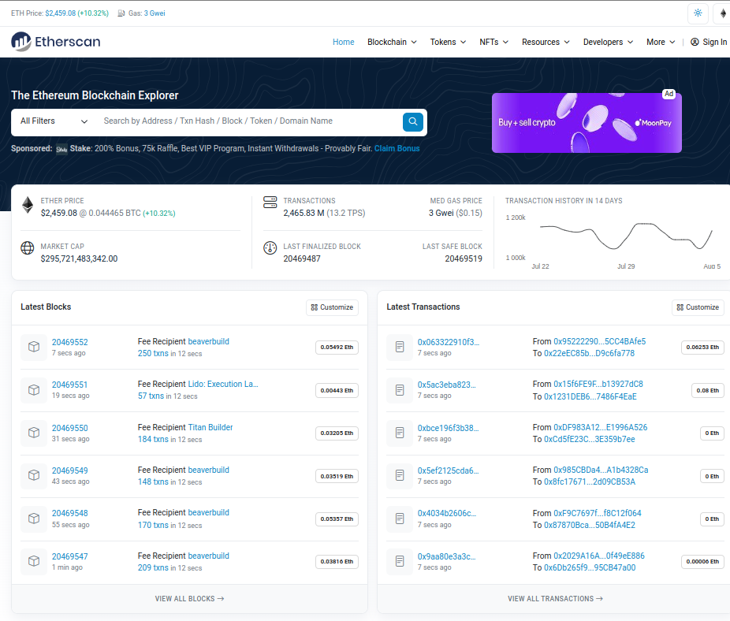
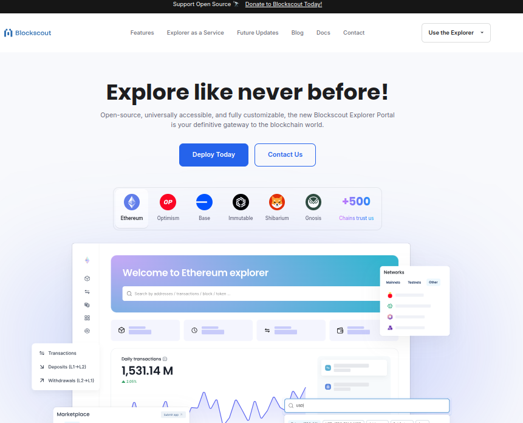

# A Comprehensive Analysis of Etherscan and Blockscout: Pros, Cons, and Alternatives

## Introduction

As a developer building an OP-Stack-based rollup, one of the critical decisions you'll need to make is selecting a suitable blockchain explorer. Blockchain explorers are like a pair of binoculars - providing transparency and insights into what is happening on the chain. They function as block explorer search engines to offer users an interface that provides them with detailed information on transactions, addresses, contracts and network statistics. The blockchain explorer can be used to verify the status of transactions, look at all things within each block and gets a better understanding of how the chain works.

Their vital function - at least where decentralization and transparency are concerned - is to ensure that blockchain technology works in a decentralized way. They enable you to monitor and audit blockchain activities in a real-time manner which is critical for developers, investors, researchers or everyday users. Developers mainly utilize blockchain explorer for debugging smart contract and verifying proper implementation.

When it comes to exploring the Ethereum blockchain and Ethereum Virtual Machine (EVM), two explorers stand out: Etherscan and Blockscout. Started back in 2015, Etherscan.co has been the best go-to for investigating anything and everything on Ethereum blockchain with its rich data set, intuitive UI & features. Meanwhile, Blockscout is an open-source multi-chain solution with flexible and allows for customization for developers.

This article aims to compare Etherscan and Blockscout, two popular tools for exploring the Ethereum blockchain and its related networks. We'll dive deep into what these platforms can do, highlighting their strengths and weaknesses.  Finally, we will also give a brief overview of some alternative explorers to ensure you get an idea of all the great tools out there for exploring blockchains.

## Etherscan: Overview, Features, Pros, and Cons
**Overview**

[Etherscan](https://etherscan.io/) is one of the most widely used and trusted block explorers for the Ethereum blockchain for any Ethereum API solution. It was launched in 2015 by a group of developers and blockchain enthusiasts, which quickly transformed itself into the main block explorer for everyone using Ethereum. Through Etherscan, users can view a well-defined structure of the Ethereum blockchain that includes transaction histories, wallet balances, smart contracts and much more. The reliability and powerful feature set has made it an indispensable tool for both casual users and professional developers within the Ethereum ecosystem.

**Features**
1. User-Friendly Interface:
	- Etherscan's interface is designed to be understandable and easy to navigate. The homepage provides quick access to key metrics such as the latest blocks, recent transactions and popular tokens.
	- Users can effortlessly search for specific addresses, transaction hashes, blocks, and tokens using the search bar.

*Etherscan screenshot*

2. Comprehensive Data:
	- Etherscan provides detailed information on every transaction, including sender and receiver addresses, gas fees, timestamps, and status.
	- Users can explore detailed profiles of wallet addresses, showing their balance, transaction history, and token holdings.

3. APIs and Developer Tools:
	- Etherscan offers a robust toolkit of APIs that empower developers to seamlessly integrate Ethereum data into their applications. This comprehensive suite covers everything from basic transaction details to in-depth smart contract insights.
	- Etherscan's well-structured documentation makes it easy for developers to dive in and leverage blockchain data for their projects.

4. Analytics and Verification Services:
	- It allows users to verify smart contracts and token information.
	- Users can access various analytics and charts related to network performance and usage.

**Pros**
- **Reputation and Trust:**

	Etherscan is considered by many Ethereum explorers to be the industry standard. Because of its extended stay in the Ethereum ecosystem, it has established a solid reputation for accuracy and dependability. Because of the community's confidence, Etherscan is the go-to option for developers looking for a trustworthy source of blockchain data.
- **Detailed Information:**

	When it comes to providing detailed and accurate blockchain data, Etherscan shines. It provides comprehensive details about tokens, blocks, smart contracts, and transactions. Developers get access to comprehensive data points, such as transaction statuses, timestamps, and gas fees. For the purpose of troubleshooting and assessing blockchain activity, this level of information is essential when building a new type of scaling solution.

- **Developer Support:**

	Etherscan offers a robust suite of [APIs](https://sebs.github.io/etherscan-api/) and [tools](https://etherscan.io/directory/Others/Tools) tailored for developers. The APIs provide access to a wide range of data, from basic transaction details to advanced analytics. Developers can integrate Etherscan's services into their applications to enhance functionality. Additionally, the Etherscan team offers thorough documentation and responsive support, ensuring that developers can effectively utilize these resources.

- **User Experience:**
	Etherscan's user interface is designed with both novice and experienced users in mind. The interface is intuitive, well-organized, and easy to navigate, allowing users to quickly find the information they need. Features like search functionalities, customizable views, and clear data presentation contribute to a seamless user experience, which is particularly beneficial when dealing with complex blockchain data.

- **Additional Services:**
	Beyond basic blockchain exploration, Etherscan offers a suite of additional features that enhance its utility. Such features are: [Dex tracker](https://etherscan.io/dex), [Gas tracker](https://etherscan.io/gastracker), [Token tracker](https://etherscan.io/tokens), [Smart contract verification](https://etherscan.io/verifyContract), [Developer tools](https://etherscan.io/directory/Others/Tools).

**Cons**
- **Proprietary:**

	Etherscan is not open-source, hence its code is not publicly available for anyone to inspect or modify. For developers, this lack of transparency can be a drawback because it limits the ability to customize the explorer to suit specific needs or integrate it more deeply with their own projects.

- **Ethereum-Centric:**

	Etherscan is designed specifically for the Ethereum blockchain. While it excels in providing detailed information and tools for Ethereum, its support for other blockchain networks is very limited. Developers working with multiple blockchains might find this focus restrictive if they need a versatile tool that can handle different chains equally well.

- **Limited Customization:**

	Since Etherscan is a closed platform, users cannot modify or extend its functionality. Developers looking for specific features or integrations that aren't already provided by Etherscan will find themselves constrained by what the platform offers out of the box. This lack of flexibility can be a significant limitation for projects that require tailored solutions or advanced custom features.

## Blockscout: Overview, Features, Pros, and Cons
**Overview**

[Blockscout](https://www.blockscout.com/) is an open-source block explorer made for Ethereum and other blockchains that use the Ethereum Virtual Machine (EVM). It’s built to be transparent and customizable, giving developers and users a flexible tool for looking at blockchain data.
*Blockscout homepage*

**Features**
- **Open-Source:**

	Unlike many other explorers that are closed systems, Blockscout's [code](https://github.com/blockscout/blockscout) is publicly accessible. This means anyone can examine, modify, or improve its features, there by making available a collaborative environment for development.

- **Multi-Chain Support:**

	Its versatility is another standout feature. Blockscout isn't confined to just one blockchain; it can explore multiple networks built on Ethereum's technology, offering a comprehensive view of the broader ecosystem.

- **Customization:**

	Users can tweak and adjust the explorer to meet their specific needs, implementing the interface and data display to their preferences.

- **Detailed Information:**

	Beyond its technical capabilities, Blockscout provides a wealth of detailed information about transactions, account activity, and smart contracts. This level of transparency is crucial for understanding blockchain activity.

- **Community Support:**

	Blockscout benefits from a strong [community](https://github.com/orgs/blockscout/discussions) of developers and users who continuously contribute to its improvement. This collaborative spirit ensures the platform stays up-to-date and relevant to the evolving blockchain landscape.

**Pros**
-	**Open-Source:**
	Being open-source, developers have the freedom to audit, modify, and deploy their own versions of Blockscout. This flexibility is invaluable for creating custom solutions, ensuring security through code transparency, and fostering innovation within the developer community.

- **Multi-Chain Support:**
	Blockscout’s ability to support various EVM-compatible chains means developers can use it as a one-stop solution for different projects. This multi-chain support simplifies the development workflow and allows for consistent tools and processes across different blockchains.

- **Customizability:**
	The high degree of customizability allows developers to tailor Blockscout to specific use cases. Whether you need to add new analytics tools, create custom dashboards, or integrate with other blockchain services, Blockscout’s flexible design makes it possible to adapt the explorer to your needs.

- **Community-Driven:**
	The active involvement of the community in Blockscout's development ensures continuous improvement and quick resolution of issues. Developers benefit from this collaborative environment where new features are regularly added, bugs are quickly fixed, and best practices are shared.

**Cons**

- **Feature Completeness:**

	Blockscout may not have all the advanced features that some proprietary explorers offer. For developers, this means you might miss out on some specialized tools or integrations that are available in other platforms. However, the open-source nature allows you to add these features if needed.

- **User Experience:**

	The interface of Blockscout might not be as polished or intuitive as that of Etherscan. This can make it a bit harder to use, especially for those new to blockchain exploration. Developers might need to invest extra time in familiarizing themselves with the UI or improving it for end-users.

- **Community Support Variability:**

	The quality and availability of support can vary depending on the community’s activity and engagement. For developers, this means that while you can often get help from the community, there might be times when support is slower or less comprehensive compared to a commercial support service.

## Comparative Analysis

- **User Interface and Experience:**
Etherscan's interface is sleek and user-friendly, making it a breeze to find the information you need. Its design is intuitive, so even newcomers can navigate it without much hassle. On the flip side, Blockscout, while fully functional, doesn't have the same level of polish. You might need a bit more time to get used to its layout and find what you're looking for.

- **Data Availability and Accuracy:**
Both Etherscan and Blockscout deliver detailed and accurate blockchain data. But because Etherscan has been around longer and focuses solely on Ethereum, it might have a slight edge in terms of data accuracy and reliability. Its established reputation adds an extra layer of trust for developers seeking precise blockchain information.

- **APIs and Integrations:**
Etherscan is well-known for its powerful APIs and developer tools, which is why it's a go-to for many developers working on Ethereum projects. These APIs are robust and well-documented, making it easy to integrate blockchain data into your applications. Blockscout also offers solid APIs, but its real strength is its open-source nature, which allows you to customize and extend its functionality to meet your specific needs.

- **Customization and Extensibility:**
Blockscout really stands out when it comes to customization and extensibility. Since it's open-source, you can modify it to match your exact requirements, adding new features or integrating it with other systems as needed. Etherscan, being a proprietary service, offers limited options for customization, which might be a drawback if you need a more tailored solution.

- **Community and Support:**
Etherscan has the advantage of a professional support team and extensive documentation, which can be a big help if you run into issues. Blockscout relies more on community support, which has its pros and cons. The quality of support can vary, but the community-driven approach often leads to innovative solutions and continuous improvements from various contributors.

## Honorable Mentions
- [Blockchair](https://blockchair.com/) is a powerful tool for developers working with multiple blockchains. It supports Bitcoin, Ethereum, Ripple, and many others, making it a versatile option. What sets Blockchair apart is its robust search engine and analytics tools. Whether you're diving into transaction histories, exploring blockchain stats, or conducting complex searches, Blockchair provides the flexibility and depth you need.

- [Ethplorer](https://ethplorer.io/es/)
If you're focused on Ethereum tokens, Ethplorer is an invaluable resource. It specializes in detailed information and analytics for ERC-20 tokens. Developers and users interested in token-specific data will find Ethplorer's insights particularly useful, whether you're tracking token transfers, analyzing smart contract activity, or keeping an eye on token metrics.

- [Tokenview](https://tokenview.io/) Tokenview offers a comprehensive look at a wide range of blockchains, including Bitcoin, Ethereum, EOS, and many more. It's perfect for developers seeking cross-chain insights. With Tokenview, you can get a holistic view of multiple networks, making it easier to compare and analyze data across different blockchains. This broad support is especially useful for projects that interact with various blockchain ecosystems.

- [BscScan](https://bscscan.com/) For those working with Binance Smart Chain (BSC), BscScan is a must-have tool. It's essentially the BSC counterpart to Etherscan, offering the same detailed data and user-friendly interface. BscScan makes it easy to explore transactions, monitor smart contracts, and analyze token activity on BSC. It's a familiar and reliable tool for anyone developing on or using BSC.

## Conclusion

Etherscan and Blockscout are both excellent blockchain explorers with their unique strengths and weaknesses. Etherscan's reputation, user-friendly interface, and robust developer tools make it a top choice for Ethereum users. Blockscout, with its open-source nature and multi-chain support, offers unparalleled customization and flexibility. By understanding the pros and cons of each explorer, users can choose the one that best fits their needs. Additionally, alternative explorers like Blockchair, Ethplorer, Tokenview, and BscScan provide valuable options for exploring other blockchain networks.
