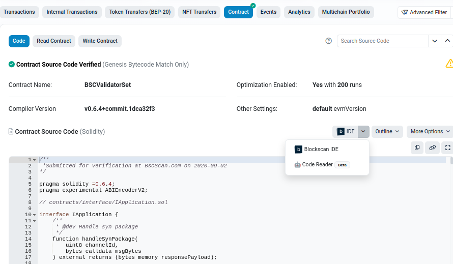
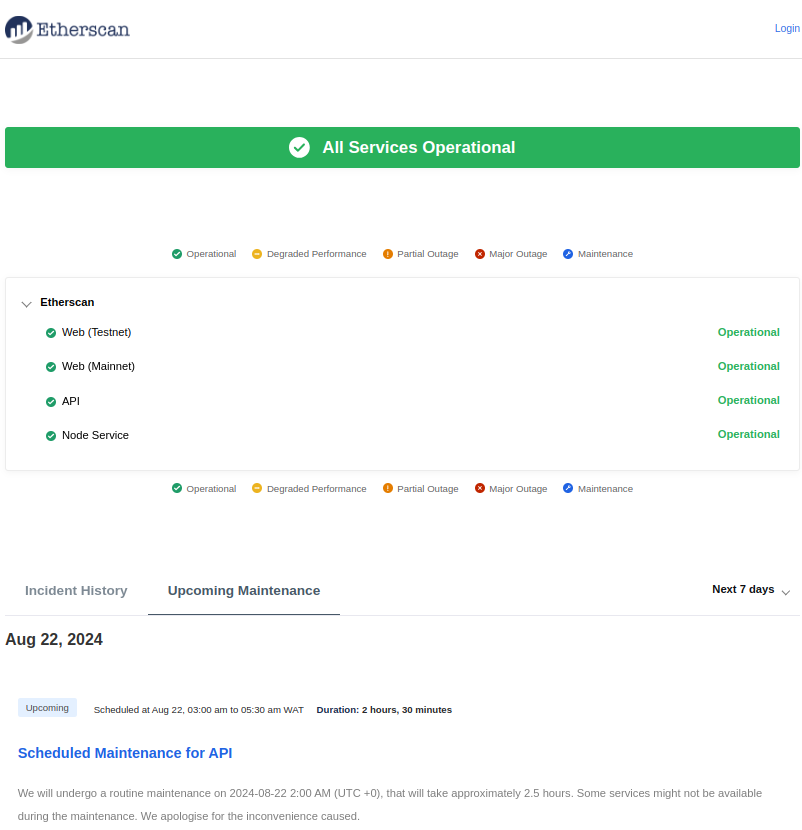
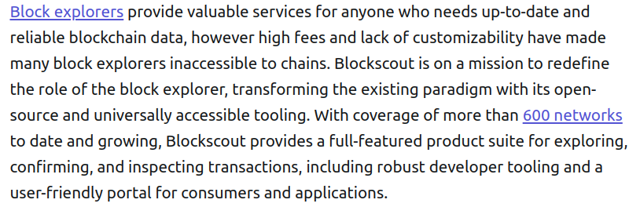
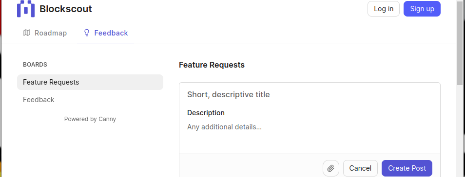
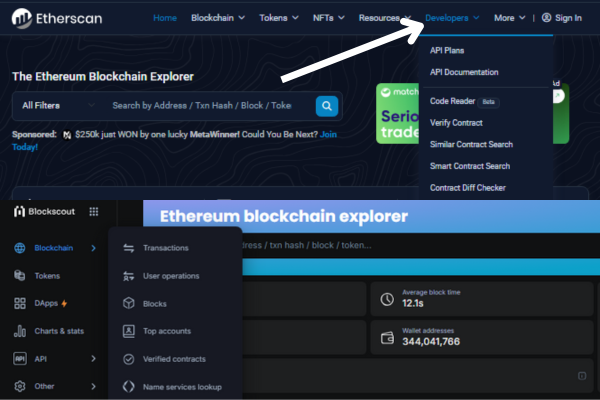
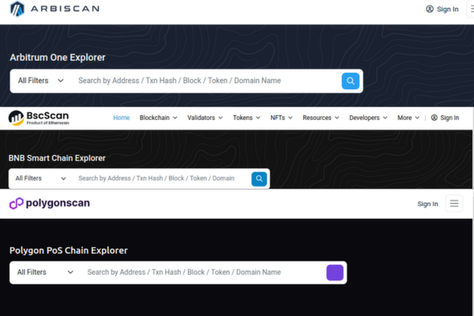
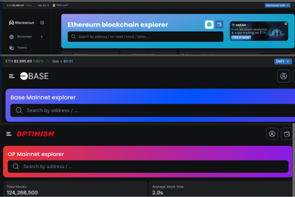
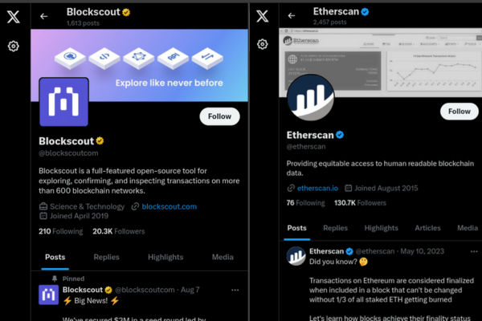

# A Comprehensive Analysis of Etherscan and Blockscout: Pros, Cons, and Alternatives

## Introduction

As a developer building an OP-Stack-based rollup, one of the critical decisions you'll need to make is selecting a suitable blockchain explorer. Blockchain explorers are like a pair of binoculars - providing transparency and insights into what is happening on the chain. They function as blockchain search engines to offer users an interface that provides them with detailed information on transactions, addresses, contracts and network statistics. The blockchain explorer can be used to verify the status of transactions, look at all things within each block and gets a better understanding of how the chain works.

When it comes to exploring Ethereum Virtual Machine (EVM), two explorers stand out: Etherscan and Blockscout. Started back in [2015](https://etherscan.io/aboutus), Etherscan.io has been the best go-to for investigating anything and everything on Ethereum blockchain with its rich data set, intuitive UI & features. Meanwhile, Blockscout is an open-source multi-chain flexible solution which allows customization for developers.

This article aims to compare Etherscan and Blockscout, two popular tools for exploring the Ethereum blockchain and its related networks. We'll dive deep into what these platforms can do, highlighting their strengths and weaknesses.  Finally, we will also give a brief overview of some alternative explorers to ensure you get an idea of all the great tools out there for exploring blockchains.

## Etherscan: Overview, Features, Pros, and Cons
**Overview**

[Etherscan](https://etherscan.io/) is one of the most widely used and trusted block explorers for the Ethereum blockchain for any Ethereum API solution. It was launched in 2015 by a group of developers and blockchain enthusiasts, which quickly transformed itself into the main block explorer for everyone using Ethereum. Through Etherscan, users can view a well-defined structure of the Ethereum blockchain that includes transaction histories, wallet balances, smart contracts and much more. The reliability and powerful feature set has made it an indispensable tool for both casual users and professional developers within the Ethereum ecosystem.

**Features**

- **Unique Wallet-to-Wallet Blockscan Chat:** 
	Etherscan offers a unique feature with [Blockscan Chat](https://chat.blockscan.com/), a decentralized messaging app that allows wallet-to-wallet communication directly through the Etherscan platform. This tool enables users to send and receive messages securely based solely on their wallet addresses, without needing personal details like email addresses or phone numbers. Blockscan Chat enhances the user experience by integrating communication into the explorer itself, making it easier for users to engage within the blockchain ecosystem.

- **Vyper Compiler Integration on Etherscan:** 
	The integration of the [Vyper compiler](https://etherscan.io/vyper) into the Etherscan platform represents a significant advantage for both developers and the broader Ethereum ecosystem. Vyper is a programming language for Ethereum smart contracts known for its focus on security and simplicity.

- **Seamless Source Code Interaction for Verified Contracts:** 
	The [Blockscan](https://bscscan.com/address/0x0000000000000000000000000000000000001000#code) IDE is a powerful feature provided by Etherscan that allows users to view and interact with the source code of verified smart contracts directly from the Etherscan platform.
	  *Blockscan verification IDE*

- **Introducing Code Reader Powered by ChatGPT:** 
	The [Code Reader](https://etherscan.io/code-reader) feature tends to enhance smart contract understanding by integrating the advanced language capabilities of ChatGPT with the technical intricacies of smart contract code. This tool is designed to assist users in interpreting and understanding the details of smart contracts by providing clear, conversational insight into the code. This is a significant advancement in smart contract analysis.

**Pros**
- **Reputation and Trust:** 
	Etherscan is considered by many Ethereum explorers to be the industry standard. Because of its extended stay in the Ethereum ecosystem since 2015, it has established a solid reputation for accuracy and dependability. Because of the community's confidence, Etherscan is the go-to option for developers looking for a trustworthy source of blockchain data.

- **Etherscan's Network Status Page Enhances User Trust and Operational Awareness:** 
	Etherscan’s dedicated [network status](https://etherscan.freshstatus.io/) page is a valuable feature that contributes significantly to its appeal and reliability as a blockchain explorer. The network status page provides users with real-time updates and detailed information about the operational status of the Etherscan platform and the Ethereum network. This feature is beneficial for maintining trust and ensuring that users are well-informed about the platform's status.
	 
	*[Network status page](https://etherscan.freshstatus.io/)*

- **Additional Services:** 
	Beyond basic blockchain exploration, Etherscan offers a suite of additional features that enhance its utility. Such features are: [Dex tracker](https://etherscan.io/dex), [Gas tracker](https://etherscan.io/gastracker), [Token tracker](https://etherscan.io/tokens), [Smart contract verification](https://etherscan.io/verifyContract), [Developer tools](https://etherscan.io/directory/Others/Tools), [Blockscan Chat](https://chat.blockscan.com/).

**Cons**
- **Proprietary:** 
	Etherscan is not open-source, hence its code is not publicly available for anyone to inspect or modify. For developers, this lack of transparency can be a drawback because it limits the ability to customize the explorer to suit specific needs or integrate it more deeply with their own projects.

- **Limited Customization:** 
	Since Etherscan is a closed platform, developers cannot modify or customize it to their desired outcome. However, it does provide "white-label" solutions, where projects can license a version with their own branding. Customization in this case is minimal and controlled by the Etherscan team, usually limited to logo and color changes. [BscScan](https://bscscan.com), [PolygonScan](https://polygonscan.com), [Arbiscan](https://arbiscan.io), [optimistic Etherscan](https://optimistic.etherscan.io) are examples of projects using Etherscan White-Label with the noticeable difference being the difference in logo from the main [Etherscan](https://etherscan.io/)

- **Etherscan API Pricing:** 
	Etherscan offers different API tiers, including free and paid plans:
	- [Free Plan:](https://etherscan.io/apis) Provides limited access with strict rate limit (e.g., 5 API requests per second)
	- [Paid Plans:](https://etherscan.io/apis) Offer more features and higher rate limits but come with significant monthly costs depending on the required usage. These plan can range from $199 per month(standard plan 10 API request per second) to $899 per month(pro plus plan with 30 API calls per second)

## Blockscout: Overview, Features, Pros, and Cons
**Overview**

[Blockscout](https://www.blockscout.com/) is an open-source block explorer made for Ethereum and other blockchains that use the Ethereum Virtual Machine (EVM) based chains. It’s built to be transparent and customizable, giving developers and users a flexible tool for looking at blockchain data. Blockscout offers a powerful interface for searching blocks, transactions, accounts, and tokens, along with developer tools like smart contract verification and a suite of optimized [APIs](https://docs.blockscout.com/developer-support/api).

**Features**
- **Open-Source:** 
	Unlike many other explorers that are closed systems, Blockscout's [code base](https://github.com/blockscout/blockscout) is publicly accessible. This means anyone can examine, modify, or improve its features, there by making available a collaborative environment for development.

- **Customization:** 
	Blockscout being open source, projects like [xDai](https://blockscout.com/xdai/mainnet), [POA](https://blockscout.com/poa/core) and [ETC](https://blockscout.com/etc/mainnet) have demonstrated how Blockscout can be customized from the backend data handling to the frontend user expirence.

- **Community Support:** 
	Blockscout thrives on strong community support across multiple platforms where users and developers stay updated on the latest news and developments. These include the [github discussion channel](https://github.com/orgs/blockscout/discussions), [active x account](https://x.com/blockscoutcom), [up-to-date monthly news platform](https://www.blog.blockscout.com/tag/news/) and [telegram channel](https://t.me/blockscoutcommunity?ref=blog.blockscout.com). This active community not only keeps everyone informed but also drives continuous improvements through collaboration, helping the platform stay relevant 

**Pros**
-	**Cost-Effective and Flexible Open-Source Solution:** 
	One of Blockscout’s biggest advantages is that it’s both open-source and free to use, making it an appealing choice for developers and projects. The open-source aspect gives developers full transparency and flexibility, letting them tailor the explorer to their specific needs. The fact that it’s free removes the financial burden, which is a big plus for small teams or startups that might not have the budget for expensive tools. With Blockscout, projects can self-host, tweak the code to fit their goals, and have full control over their data and user experience—all without breaking the bank. 
	 
	*source: [Blockscout Raises $3M Seed Round Led by 1kx](https://www.blog.blockscout.com/blockscout-raises-3m-seed-round-led-by-1kx/)*

- **Customizability and Flexibility:** 
	One of the standout advantages of Blockscout is its high level of customization, which is made possible by its open-source nature. Unlike proprietary explorers, Blockscout allows projects to tweak everything from backend data processing to the frontend user interface. This flexibility is especially valuable for projects that need to tailor the explorer to their specific branding, user experience, or technical requirements.

	For instance, projects like [optimism](https://optimism.blockscout.com/), [base](https://base.blockscout.com/), [Arbitrum One explorer](https://arbitrum.blockscout.com/) and [many more](https://www.blockscout.com/chains-and-projects) have successfully customized Blockscout to fit their unique needs. They’ve adapted both the appearance and functionality to align with their networks’ objectives, creating a consistent user experience while maintaining full control over data presentation and access.

	This flexibility also translates into long-term cost savings since projects can avoid expensive licensing fees and keep everything in-house. As blockchain ecosystems grow and evolve, the ability to continuously adapt and improve the explorer is a crucial advantage for both developers and end-users.

- **Community-Driven Development and Feedback:** 
	The availability of a [public feature suggestion](https://blockscout.canny.io/feature-requests) and [Roadmap](https://blockscout.canny.io/) platforms are key advantages for Blockscout, offering developers more control and influence over the platform’s direction. This level of community engagement, combined with prompt responses and support, ensures that user needs are quickly addressed and prioritized. This transparency and responsiveness is a feature making Blockscout more appealing to developers who want a more responsive, user-driven explorer with active community involvement.
	

- **Improvement of AI Features:** 
	Blockscout on Febuary 8, 2024 annouced [AI Features Arrive on Blockscout](https://www.blog.blockscout.com/block-explorer-ai/), they listed the following as blockscout AI directions:
	- Providing simple transaction summaries
	- Bridging transactions which involve external metadata
	- Staking and other complex transactions.
	- Account abstraction.
	- Recent transaction summaries for individual wallets.

	On August 7, 2024, blockscout annouced [the raise  of $3M fund](https://www.blog.blockscout.com/blockscout-raises-3m-seed-round-led-by-1kx/) led by 1kx.  The funds will help Blockscout enhance its product offerings, integrate social features and AI tools into their dashboard, and streamline the deployment of their Explorer-as-a-Service. This investment will also support new and existing projects, aligning with the goal of providing valuable, customizable data to developers and users alike.

**Cons**

- **Feature Completeness:** 
	Blockscout may not have all the advanced features that some proprietary explorers offer. For example, the lack of  [Vyper online compiler](https://etherscan.io/vyper) feature can be a challenge for developers who require quick access to Vyper compiler, it does not necessarily render the platform less useful overall. Developers who need this specific functionality can supplement their use of blockscout with other specialized tools designed for compiling vyper codes.

- **Long-standing unresolved Issues:** 
	Some [issues](https://github.com/blockscout/blockscout/issues?page=13&q=is%3Aissue+is%3Aopen) raised on the Blockscout GitHub repository have not been closed for over 5 years. This lack of responsiveness raises concerns about the project’s maintenance, and might potentially discourage developers from relying on Blockscout for critical applications.

## Comparative Analysis

- **User Interface and Experience:** 
	**Etherscan:** Offers a well-defined "Developer" section in its header, making it easy for developers to find API documentation and related tools directly from the main interface.

	**Blockscout:** Does not have a dedicated "Developer" section in its header. Instead, developer resources are more integrated into the overall site structure or accessible through external repositories like GitHub. 
	
	 *Comparism of Etherscan and Blockscout explorer interface*

	For developers using Blockscout, finding relevant tools and documentation might involve navigating through different sections of the site or exploring external links like [Blockscout repository](https://github.com/blockscout/blockscout?tab=readme-ov-file) rather than accessing a centralized developer-focused area.

- **Custom Bytecode Management for Developers:** 
	The closest alternative to the [Ethereum Bytecode Database Microservice](https://docs.blockscout.com/about/features/ethereum-bytecode-database-microservice) offered by Blockscout in the Etherscan block explorer is Etherscan's [Contract Verification and Publishing Service](https://docs.etherscan.io/contract-verification/whats-contract-verification) which allows users verify smart contracts, read contract source code and interact with verified contracts. The Ethereum Bytecode Database Microservice provides [verification](https://docs.blockscout.com/about/features/ethereum-bytecode-database-microservice#verification), [bytecode storage](https://docs.blockscout.com/about/features/ethereum-bytecode-database-microservice#initial-planning), [bytecode source search](https://docs.blockscout.com/about/features/ethereum-bytecode-database-microservice#bytecode-source-search), [adding extractors](https://docs.blockscout.com/about/features/ethereum-bytecode-database-microservice#adding-extractors), [similar contracts search enhancement](https://docs.blockscout.com/about/features/ethereum-bytecode-database-microservice#similar-contracts-search-enhancement) and access to it API . 

- **Customization and Extensibility:** 
	Blockscout is significantly more customizable and extensible for developers who want to tailor the service to their specific needs. If your goal is deep customization and the ability to extend the explorer with new features, Blockscout is the better option. It offers complete control over the deployment, design, and feature set. Etherscan, while user-friendly and comprehensive, is much more rigid and is better suited for developers who need reliable, out-of-the-box solutions rather than a highly customizable platform.
	
	 
	*screenshot of etherscan powered expolorers*

	 
	*screenshot of blockscout explorers*

- **GraphQL API Advantage:** 
	The absence of a GraphQL API in the Etherscan could be seen as a limitation for developers who prefer the flexibility of GraphQL, especially when building applications that need precise data queries. Blockscout's inclusion of a [GraphQl API](https://eth.blockscout.com/graphiql) can be an advantage for projects that require more efficient and customizable data fetching.
	While Etherscan is feature-rich and reliable option with comprehensive REST API, Blockscout's inclusion of a GraphQL API provides additional flexibility, making it potentially more appealing in certain use case.

- **API Pricing and Flexibility:**  
	Developers looking to integrate blockchain data into their application there is a significant difference in pricing and flexibility to consider. 

	Etherscan offers two tier of pricing model, free and paid [plan](https://etherscan.io/apis#pricing-plan). Etherscan's API pricing is focused on scalability, allowing developers to choose plans based on their needs, with the ability to upgrade as application usage grows. The free tier is ideal for small projects or prototyping, while the higher plans are more suited for production-level application requiring extensive blockchain data.

	Blockscout, being open-source, doesn't have a direct pricing model like Etherscan. instead self-hosted, free API service which give full control over the API usage without direct costs tied to API calls. Hosting Solutions provided by third party providers usually comes with custom plans. For project that want complete control over their block explorer, Blockscout's open-source nature is advantageous. However it requires more technical expertise and resources to maintain.

	When considering API pricing, Etherscan is better suited for developers seeking quick, reliable access to blockchain data with predictable costs. On the other hand, Blockscout appeals to those who prefer self-hosting with more control over costs and customization, making it a more flexible, though technically demanding, option.

- **Community and Support:** 
	As at the time of composing this article, while Etherscan has large number of follower on [Twitter](https://x.com/etherscan), Blockscout appears to be more active and engaged with the community on [Twitter](https://x.com/blockscoutcom). This means that Blockscout focuses more on regular updates, interactions, and engaging directly with developers and users, which is valuable for an open-source project.

	Aside twitter, Blockscout maintain social media presence across various [platforms](https://www.diadata.org/web3-infrastructure-map/blockscout/#cea99de3c8bb48d1abf2f0eaf49f6036) whereas Etherscan does not maintain such.

	 
	*Etherscan Vs Blockscout Twitter page*
	
## Honorable Mentions
- [Blockchair](https://blockchair.com/) is a powerful tool for developers working with multiple blockchains. It supports Bitcoin, Ethereum, Ripple, and many others, making it a versatile option. What sets Blockchair apart is its robust search engine and analytics tools. Whether you're diving into transaction histories, exploring blockchain stats, or conducting complex searches, Blockchair provides the flexibility and depth you need.

- [Ethplorer](https://ethplorer.io/es/)
If you're focused on Ethereum tokens, Ethplorer is an invaluable resource. It specializes in detailed information and analytics for ERC-20 tokens. Developers and users interested in token-specific data will find Ethplorer's insights particularly useful, whether you're tracking token transfers, analyzing smart contract activity, or keeping an eye on token metrics.

- [Tokenview](https://tokenview.io/) Tokenview offers a comprehensive look at a wide range of blockchains, including Bitcoin, Ethereum, EOS, and many more. It's perfect for developers seeking cross-chain insights. With Tokenview, you can get a holistic view of multiple networks, making it easier to compare and analyze data across different blockchains. This broad support is especially useful for projects that interact with various blockchain ecosystems.

- [BscScan](https://bscscan.com/) For those working with Binance Smart Chain (BSC), BscScan is a must-have tool. It's essentially the BSC counterpart to Etherscan, offering the same detailed data and user-friendly interface. BscScan makes it easy to explore transactions, monitor smart contracts, and analyze token activity on BSC. It's a familiar and reliable tool for anyone developing on or using BSC.

## Conclusion

Etherscan and Blockscout are both excellent blockchain explorers with their unique strengths and weaknesses. Etherscan's reputation, user-friendly interface, and robust developer tools make it a top choice for Ethereum users. Blockscout, with its open-source nature and community engagement, offers unparalleled customization and flexibility. By understanding the pros and cons of each explorer, users can choose the one that best fits their needs. Additionally, alternative explorers like Blockchair, Ethplorer, Tokenview, and BscScan provide valuable options for exploring other blockchain networks.
